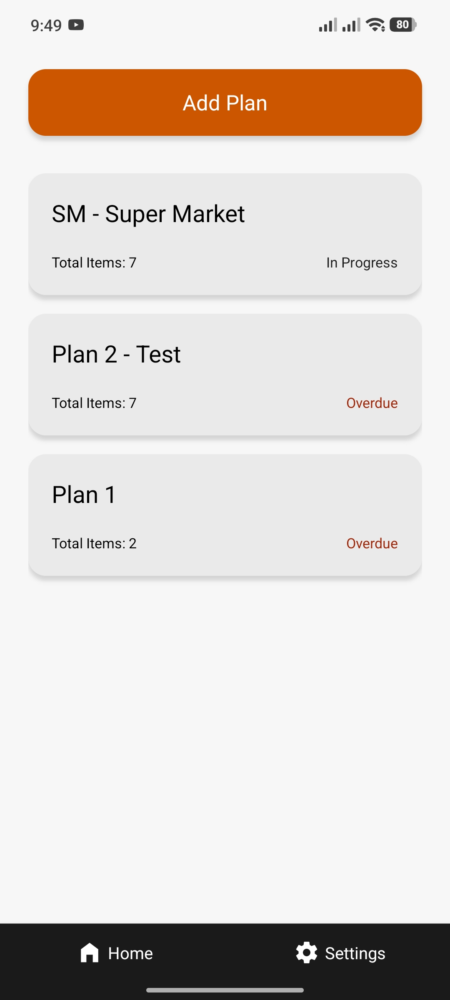
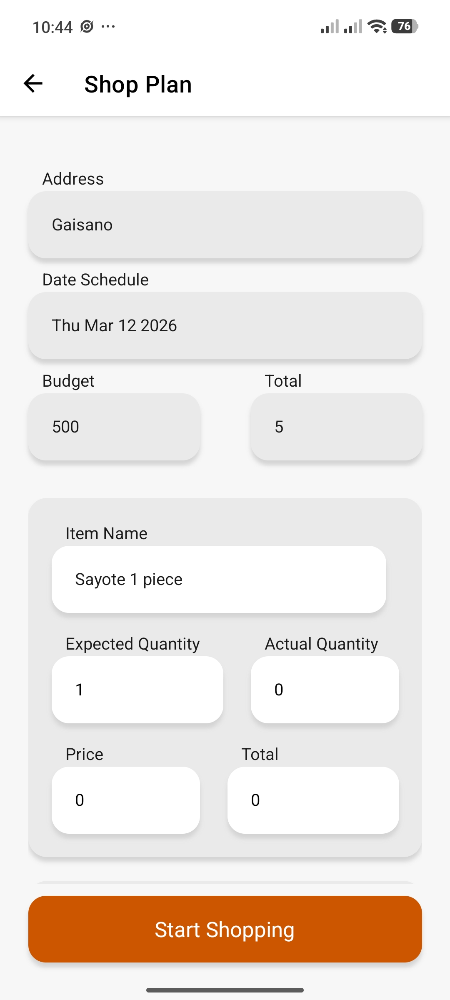
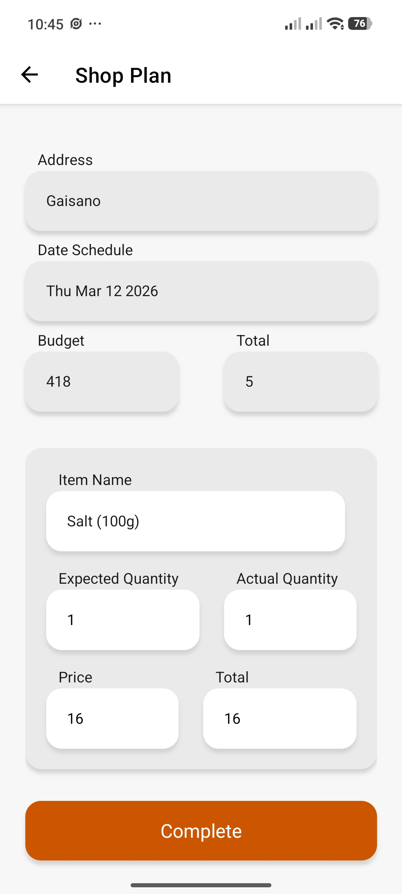

# ShopPlanr — Mobile App (Expo)

> A smart shopping planner that helps you organize your grocery runs, set budgets, and track your actual spending in real time.

---

## 📱 Screenshots

| Home / Plans                           | Plan Details                                 | Shopping Mode                                  |
| -------------------------------------- | -------------------------------------------- | ---------------------------------------------- |
|  |  |  |

---

## ✨ Features

- 📋 **Create Shopping Plans** — Set up a plan with a store location, scheduled date, and total budget before your shopping trip.
- 🛒 **Plan Your Items** — Add the items you intend to buy, including the planned quantity for each.
- 📍 **Store Location** — Attach a location to each plan so you know exactly where you're headed.
- 📅 **Scheduled Date** — Set a date for the trip so your plans are organized chronologically.
- ✅ **Shopping Mode** — When the scheduled date arrives, activate the plan to start recording your actual purchases.
- 💰 **Real-time Budget Tracking** — Input the actual quantity bought and the price per item; the app automatically deducts from your budget as you shop.
- 📶 **Offline Support** — Fully functional without internet using local SQLite storage; syncs with the server when back online.

---

## 🛠 Tech Stack

- **Framework:** React Native (Expo)
- **Offline Storage:** SQLite (via expo-sqlite)
- **Data Source:** REST API (shared with web versions)
- **Language:** JavaScript / JSX

---

## 🚀 Setup & Installation

### Prerequisites

Make sure you have the following installed on your machine:

- [Node.js](https://nodejs.org/) (v18 or higher recommended)
- [Expo CLI](https://docs.expo.dev/get-started/installation/)
    ```bash
    npm install -g expo-cli
    ```
- [Expo Go](https://expo.dev/client) app installed on your phone (for testing on a physical device), **or** an Android/iOS emulator set up locally.

---

### Steps

**1. Clone the repository**

```bash
git clone https://github.com/Just-Pyro/shopplanr-expo101.git
cd shopplanr-expo101
```

**2. Install dependencies**

```bash
npm install
```

**3. Configure the API base URL**

Serve the Blade Version:

```bash
php artisan serve
```

> Please look up the Blade version for setup and installation [ShopPlanr - Blade](https://github.com/Just-Pyro/Shopplanr).

**4. Start the development server**

```bash
npx expo start
```

**5. Open the app**

- **Physical device:** Scan the QR code in the terminal using the Expo Go app.
- **Android emulator:** Press `a` in the terminal.
- **iOS simulator:** Press `i` in the terminal (macOS only).

---

## 📁 Project Structure

```
shopplanr-expo/
├── app/              # Screens and navigation
├── components/       # Reusable UI components
├── services/         # API & Database (SQLite) call functions
└── assets/           # Images and fonts
```

---

## 🔗 Related Repositories

- [ShopPlanr — React Web](https://github.com/Just-Pyro/ShopPlanr-web)
- [ShopPlanr — Laravel Blade](https://github.com/Just-Pyro/Shopplanr)

---

## 📄 License

This project is for portfolio purposes.
